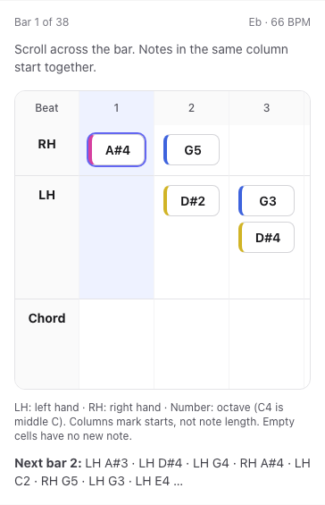
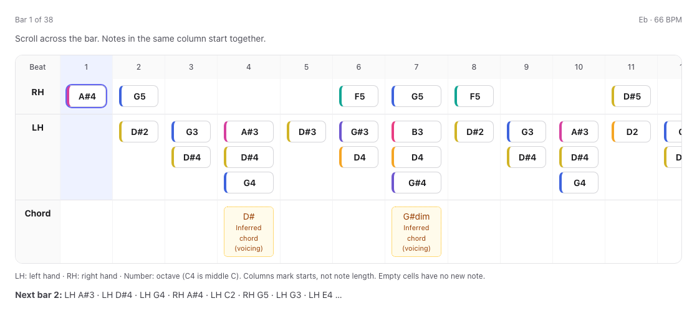
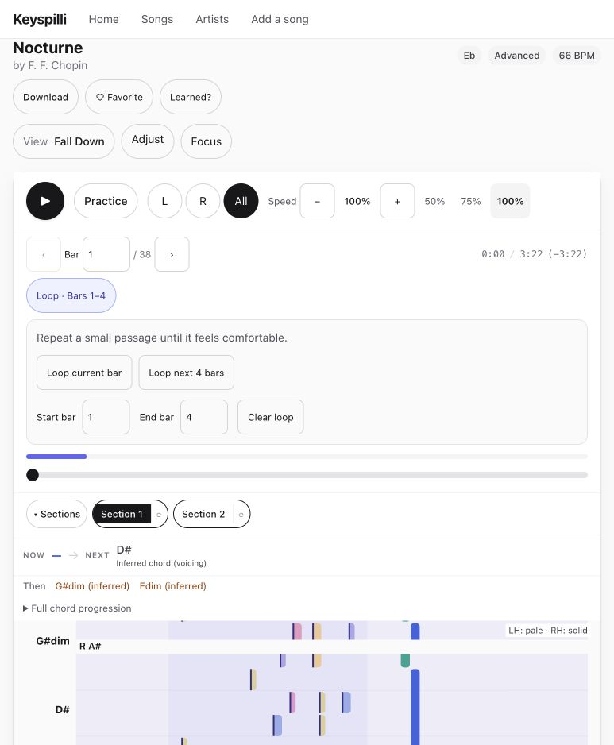
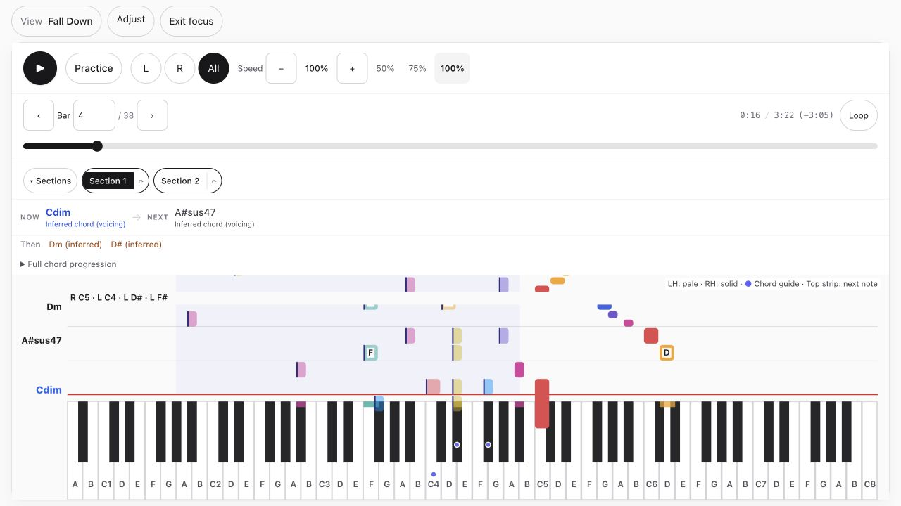
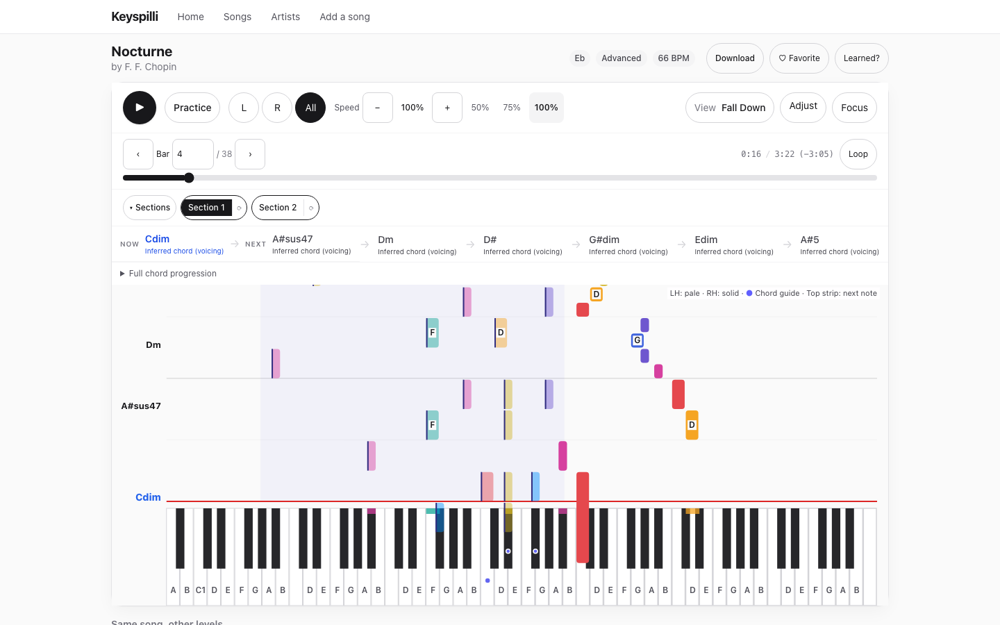

# Note-letter readability refresh — 2026-09-09

Continuation of the player refresh, based on merged main `5c02508`, branch `codex/player-readability`. Original checkout and unrelated work preserved.

Observed locally: dense Advanced Chopin notes overlapped in the pitch-position SVG; scaling the entire diagram reduced label sizes on narrow screens. Replaced it with native table semantics: chronological note-start columns, separate RH/LH rows, stacked simultaneous notes, fixed readable labels, and a keyboard-focusable horizontal scroll region. Active starts and sounding notes are highlighted; following time only scrolls the panel. Preserves transposed pitches, chord provenance, lyrics, and the next-bar preview. Beat labels account for the time-signature denominator. This is an onset view, not proportional notation or note-duration engraving; copy states that limit.

Validation: 175 web unit tests; production build including type validation; 45 player/navigation Playwright checks against the built app. Added mobile/desktop geometric checks for non-overlapping labels, minimum14px label size, internal follow scrolling, rewind, and no page-width overflow. Transpose regression failed before implementation and passed afterward. Existing practice/speed/source selection checks pass.

Screenshots captured with reduced motion and reopened for inspection:

Local preview: http://127.0.0.1:3000/player/f-f-chopin-nocturne-a/beginner . No production deployment, real hardware, acoustic, or complete accessibility certification claimed for this follow-up.

## Transport and loop follow-up

Added current-bar and next-four-bars loop shortcuts, a full-width loop editor, active-loop styling and a timeline range marker. Shared loop preset logic now uses actual measure boundaries and clips at the final measure. Previous/next bar and speed-step controls are disabled at their limits. Seek announces the current bar and elapsed/total time to assistive technology.

Verified:175 web tests; production build/type validation;46 player/navigation browser checks. The new phone-width regression failed before implementation and now covers presets, final-bar clipping, stable loop-marker proportions after a speed change, and no horizontal page overflow. Desktop screenshot captured and reopened. The preceding note-letter commit's CI34284140678 passed; this follow-up is locally verified, not deployed.

## Chord guide clarification and timing fix

Renamed Chord Keys to Chord guide, preserving the existing preference key. Replaced full-key chord tinting with small indigo/white dots on exact voicing pitches; pressed-note colors and upcoming strips stay distinct. Added an overlay legend and explanation beside adjustments, including inferred-harmony guidance.

Canvas active-chord selection now honors durationBeats exactly like ChordStrip, clearing cached voicing markers through explicit gaps. Legacy events still last until the next event. Actual draw-call regression covers white/black markers, exact duration end, next-event restoration and disabled guide; it failed before the change.176 web tests, production build/type validation and47 browser checks passed. Browser coverage verifies explanation and persisted toggle. Focus-mode screenshot at Chopin Advanced bar4 captured and reopened. No production deployment in this follow-up.

## Compact toolbar and viewport allocation

Moved View/Adjust/Focus into the playback toolbar; song actions sit beside title/metadata on wide screens. A flex workspace allocates remaining viewport height to falling notes instead of the640px cap and fixed subtraction. Expanding settings still has room to reflow; alternate notation views keep natural document sizing. Removed inline-range baseline whitespace; retained short-landscape Focus minimums.

After the one-time speed notice is dismissed, measured canvas:461.7px in a900px-high desktop viewport (51%);931.7px in1370px (68%), ending28px above the viewport bottom.4-bar Advanced Chopin screenshots at1440/1740/390px saved;1440/390 reopened for visual review. The desktop allocation tests failed before the change. Final production build/type validation and50 player/navigation browser checks passed, including four Focus viewports, phone bounds, normal viewport sizing and toolbar alignment. No deployment.

