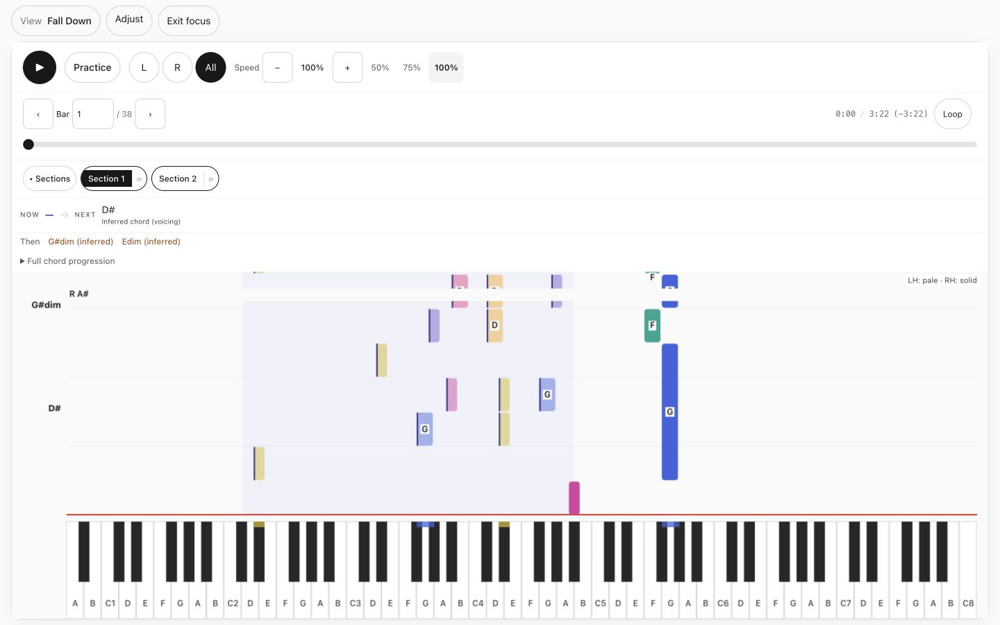
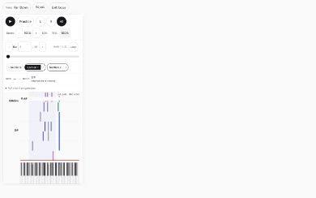
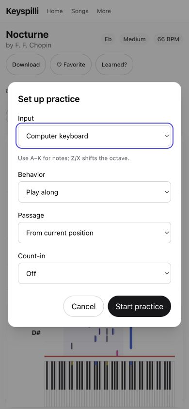

# Player polish — execution evidence

Date: 8 September 2026. Application commit: `04ce0e6`. Base: `0d5f78a` (`origin/main`). Branch: `codex/player-polish`.

Implemented the approved player review: song actions separated from playback; deliberate practice setup and bounded scored attempts; viewport-sized note lanes; stable, readable chord guidance; clearer alternate views and sound settings. Existing preference keys and route IDs remain unchanged. No dependencies were added.

## Verified checks

| Check | Result |
| --- | --- |
| `npm test` | 1,881 passed across six workspaces |
| `npm run typecheck` | All workspaces passed |
| `npm run build` | Production build passed |
| Player UI browser suite | 20 passed, including the separate final accessibility check |
| Existing app player/score regression subset | 7 passed |
| Independent code review | Three findings fixed and re-reviewed; no remaining concrete findings |

Node: `/Users/reidar/.nvm/versions/node/v22.22.3/bin`. Browser checks ran against `next start` from this build at `127.0.0.1:3000`, with a private SQLite backup and copied artifacts under `.player-review/data`; no production data writes. Full test/build logs remain in `.player-review/` locally.

The browser checks cover play/pause/seek, bar jump, loop bounds, hands/speed, scoped result/repeat, count-in cancellation, opt-in microphone denial/recovery, computer-key chord input, sound-preview position, organ/synth persistence and active sound swaps, sections, full width, lazy direct-sheet loading, long-score virtualization, view switching, keyboard focus/Escape, reduced motion and 200% CSS zoom. Focus geometry and paused height-only redraw pass at 1440×900, 1024×768, 390×844 and 844×390.

Two regressions were demonstrated before implementation: Practice had no setup dialog; Bar had no input. Additional shared checks cover bounded grading and keyboard/microphone wait advancement, empty-range rejection, fixed chord gutter during playback, chord gaps, declared cross-bar harmony, no lyrics, octave keydown-only shifts, and preserved note release.

## Visual evidence

Final production-build captures:

Additional inspected captures (some taken in the development preview before the final build): [desktop normal](player-polish-2026-09-08/desktop-player.png), [phone normal](player-polish-2026-09-08/phone-player.png), [tablet](player-polish-2026-09-08/tablet-focus.png), [short landscape](player-polish-2026-09-08/landscape-focus.png), [settings](player-polish-2026-09-08/desktop-settings.png), [desktop setup](player-polish-2026-09-08/desktop-practice-setup.png), [note letters](player-polish-2026-09-08/desktop-note-letters.png), [phone note letters](player-polish-2026-09-08/phone-note-letters.png), [lead sheet](player-polish-2026-09-08/desktop-lead-sheet.png), [phone lead sheet](player-polish-2026-09-08/phone-lead-sheet.png), [score](player-polish-2026-09-08/desktop-sheet.png), [phone score](player-polish-2026-09-08/phone-sheet.png), [chord practice](player-polish-2026-09-08/desktop-chord-practice.png), [phone chord practice](player-polish-2026-09-08/phone-chord-practice.png).

The accepted live review is the primary before-state; [local integration baseline](player-polish-2026-09-08/integration-desktop-before-controls.png) was captured after initial canvas changes and before control reordering, so it is not a pristine before screenshot.

## Boundaries and deliberate limits

- Local fixture: Chopin Nocturne Medium. The reviewed production preview ID was absent locally; its beta/timing notice was preserved and tested at component level, not recaptured on that exact preview.
- No real MIDI device, microphone acoustic accuracy, sampled-piano listening quality, physical touch-device behavior or complete accessibility certification is claimed. Sampled preview was invoked in-browser; deterministic browser timing checks use synth.
- 200% verification uses CSS zoom; OS/browser magnification was not changed. Native modal tab navigation may reach browser chrome; background player controls remain inert.
- Chord practice truthfully describes its existing window of up to four bars, independently of the scored loop scope. Shift+H hears the chord; H remains the A-note key.
- Dense note-letter circles can still overlap because the underlying arrangement/notation layout is unchanged. Repeated clef changes and arrangement simplification remain a separate engraving/learning-quality investigation.
- No merge or deployment performed. The original checkout and its unrelated catalogue/transcription WIP were preserved. Private preview data stays local and ignored by Git.
