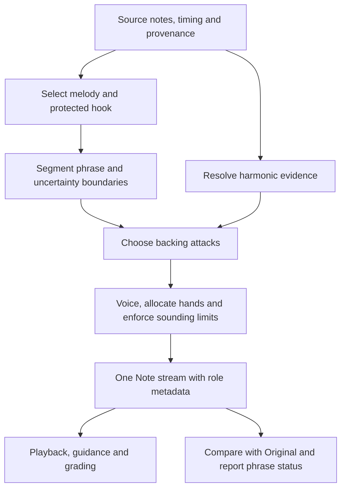

# Musically useful Melody + Accompaniment Implementation Plan

> **For agentic workers:** Use `superpowers:executing-plans` and work through the checkboxes in dependency order. The existing Luna task is the intended implementer, with parent review at the gates below. Do not create more tasks or agents by default. This document authorizes no execution, merge, deployment, catalogue rebuild, or production data changes by itself.

**Goal:** Produce a recognizable melody with noticeably simpler, musically coherent and physically playable accompaniment, and explain exactly when the result is unchanged, partial or unavailable.

**Architecture:** Keep one deterministic producer behind `buildMelodyAccompaniment`. Separate melody selection, harmonic evidence, accompaniment rhythm, voicing/hand allocation, and measured output changes. Reuse existing MIDI helpers and the ordinary Note playback path; use a small phrase result structure rather than a second arrangement framework.

**Tech Stack:** Existing TypeScript, @keyspilli/midi, @keyspilli/player-core, Next.js/React, Vitest and Playwright. Node 22. No new dependency or external model service planned.

**Spec:** Sections 1–8 below are the proposed product/technical specification; sections 9–14 are its executable work plan. This supersedes the musical acceptance and backing-generation portions of the 2026-09-16 useful-melody-accompaniment plan. Earlier evidence remains historical, not automatically valid against the new contract.

**Status:** Active implementation through the current branch head on 17 September 2026. Engineering portions of T5/T6/T7/T8 and the reserved capture portion of T9 are verified; G3 human listening, G2 source/musical review, parent review, merge and deployment remain pending. Estimates remain engineering effort ranges, not musical-quality promises.

## Global constraints

- Original source notes, catalogue variants, source MIDI/XML and existing user data remain recoverable and unchanged.
- Hand/staff/track labels are evidence about a part, not proof of melody or accompaniment.
- Protect selected melody pitch, onset, duration and velocity. Any later expressive balancing affects accompaniment, not stored source melody.
- Do not require transformed audio to be different when the original passage is already simple. Report that outcome honestly instead of inventing notes to meet a quota.
- No song-ID, title, or hardcoded pilot-window branches in production logic.
- No source guessing from missing metadata; distinguish inferred, authored, user-selected, and unavailable evidence.
- Existing Bass + chords behavior is outside this redesign except shared correctness regressions.
- Use one ordinary Note event stream for melody-mode playback, display and grading. Chord labels are annotations, not another audio channel.
- All browser/testing work uses disposable consistent SQLite/artifact copies, never canonical or production data. Preserve canonical WIP and existing deployment evidence.
- Before long loops run `df -h /System/Volumes/Data`; stop below 30GiB. Use `/Users/reidar/.nvm/versions/node/v22.22.3/bin` in PATH. Verify package scripts locally; the repository has workspace `test` scripts despite older global documentation.
- Live testing, deployment and a catalogue rebuild are separate decisions. A user-authorized live release may precede human listening, but must be labelled an experimental candidate until accepted.

## 1. Why another patch is insufficient

The deployed repair fixes a real problem: replacing rhythm with long chord blocks. It does not yet deliver a reliable piano reduction.

| Finding | Evidence read for this plan | Consequence | Work item |
|---|---|---|---|
| Melody picker must choose one candidate at every onset | `packages/midi/src/piano-roles.ts`, DP/backtracking in `splitPianoRoles` | Backing attacks become melody during rests | T3 |
| Ambiguity is based on nearby top pitches/velocity/duration, separately from the chosen path | `findAmbiguousMelodySpans` in `accompaniment.ts` | Ordinary unisons/seconds can produce a wall of warnings; confidence is not tied to the actual selection | T3/T8 |
| Any ambiguity overlap skips a whole harmony event | `buildMelodyAccompaniment` event loop | A short uncertain moment retains a much longer original passage | T2/T4 |
| Backing is lowest plus up to two upper notes at original attacks | `reduceSourceSupport` | Output can be a near-copy and rhythm complexity remains | T5 |
| Three notes per onset does not cap notes still held | `reduceSourceSupport`, source crossing handling | Total sounding span/polyphony may be unplayable | T6 |
| Generic quarter-note pulse used only when source backing is empty | `sparseHarmonicSupportNotes` | Rhythm neither chosen for the phrase nor reliably contrasted with Original | T5 |
| All chord pitch classes required by current voicing helper | `learningChordNotes` | Extended harmony may fail instead of yielding an explicitly incomplete but useful shell | T4/T6 |
| Fallback counter derives from chord coverage, not rendered-note equality | `fallbackBeats` vs `replacementCovered` | “Retained” can misdescribe changed audio | T2 |
| Right-hand override selects every tagged RH note and clears uncertainty | `selectMelodySource` | Warning removal is not evidence of correct melody selection | T3/T8 |
| Player eagerly computes melody arrangement even in Original mode | `Player.tsx` useMemo | A heavier arranger could slow unrelated use | T7 |

The user screenshot shows 438 source support notes and 238.9 retained; these are not musical-quality scores. Historical local Oops beat 48–68 counts were Original 55 notes, automatic candidate 46, RH candidate 55. Production artifacts differed from that local snapshot, so T1 must pin fresh data rather than reuse those counts as current truth.

## 2. Product contract

### What the learner gets

- **Original arrangement:** the imported arrangement.
- **Melody + accompaniment:** a learning arrangement preserving the tune, with simpler backing designed around it.
- **Bass + chords:** accompaniment for singing or another musician.

Keep the existing selector initially; clarify its copy. A broad settings redesign is not needed to make this work.

For each phrase, answer independently:
1. Which notes are protected as melody or a defining hook, and why?
2. What harmony is supported, and by which evidence?
3. What backing strategy was used?
4. Did audible note content actually change?
5. Does the result satisfy the configured playability constraints?
6. Does a person judge it recognizable and musically useful?

A generated label does not answer questions 4–6. A user-selected part answers only what the user selected.

### Target scope

First release targets one conservative learning arrangement, not six new difficulty generators or a style marketplace. It supports mixed-hand melodies and source-based rhythm when evidence permits. Advanced contrapuntal music, absent melody, unaligned charts and poor transcriptions can remain unsupported with a specific explanation.

A simple original passage can correctly stay unchanged. A song with no useful changed phrases must say “No useful simplification found” and offer Original; it must not advertise successful transformation.

## 3. Design choices and tradeoffs

| Approach | Benefit | Failure risk | Decision |
|---|---|---|---|
| Continue source thinning alone | Small, preserves timing | Cannot reliably simplify rhythm; current near-copy issue | Keep as one candidate only |
| Replace everything with fixed bass/chord pulses | Obvious difference and simple implementation | Wrong groove, empty melody rests filled, loss of hooks | Reject as default |
| Phrase-based reduction with source rhythm and a sparse harmonic alternative | Can preserve identity while reducing physical demands | Requires reliable selection and evaluation | Recommended |
| New ML transcription/arrangement service | Might improve weak inputs | Cost, latency, uncertain quality and larger operating surface | Escalation only if bounded evidence shows symbolic inputs insufficient |

The proposed algorithm is a hypothesis to evaluate, not established musical research. Do not assign invented accuracy percentages or claim universally appropriate rhythmic rules.

## 4. Proposed data flow and result contract



Keep `buildMelodyAccompaniment(sourceNotes, chordTimeline, options)` as the public entry point. Extend options, rather than add a competing producer. Retain legacy fields only while consumers migrate, then remove stale calculations in the same change series.

Proposed additions, defined here for later tasks:

```ts
interface MelodyPhraseOverride {
  startBeat: number;
  endBeat: number;
  sourceNoteIds: readonly string[]; // empty explicitly means melody rests
}
interface ArrangementPhrase {
  startBeat: number;
  endBeat: number;
  melodySourceIds: readonly string[];
  strategy: "source-reduction" | "harmonic-backing" | "original" | "silence";
  change: "changed" | "unchanged";
  review: "automatic" | "user-selected" | "needs-review";
  reasons: readonly string[];
}
interface ArrangementEvent {
  id: string;
  note: Note;
  role: "melody" | "accompaniment" | "retained-unclassified";
  sourceNoteIds: readonly string[];
}
interface ArrangementChangeSummary {
  changedBeats: number;
  unchangedBeats: number;
  silentBeats: number;
  reviewBeats: number; // orthogonal; overlaps the other categories
  addedNotes: number;
  removedNotes: number;
  alteredNotes: number;
}
```

Add `events`, `phrases`, and `changeSummary` to `MelodyAccompanimentResolution`. `notes` is the projection of events, never independently regenerated. Add optional `phraseOverrides` and source timing metadata to `MelodyAccompanimentOptions`. Use actual existing timing types after tracing the Player payload in T1; do not fabricate a meter from a missing field. `ArrangementEvent.id` belongs to the derived event; sourceNoteIds retain lineage through support changes.

Use generator version `melody-accompaniment.v2`. Source fingerprint covers note content; derived-result identity additionally covers normalized harmony contents/source, selections, meter information and generator version. Role and physical hand stay separate. An event's L/R label is a playing assignment, never proof of musical role.

### Change measurement

Partition the complete timeline into nonoverlapping intervals using relevant source/output start/end boundaries. Compare active audible event multisets using pitch, start, duration and velocity, excluding labels, IDs and hand metadata. Exact source-preserving operations should compare exactly; use the existing timing epsilon only for floating-point boundary arithmetic. Report hand reassignment separately if useful.

- Changed, unchanged and silent durations partition the full duration.
- Silent means no source or output note is sounding.
- Review duration is a separate union, not added to those totals.
- Added/removed/altered counts use event lineage; generated events without a source are added, unmatched source events removed, a changed source-linked event altered. Do not count a revoiced event as all three.
- Exact equality is not a musical usefulness score. Publish a separate human evaluation result.

## 5. Melody and harmonic evidence

### Melody selection

Introduce an explicit rest/no-new-melody state into the existing DP under an opt-in option for melody mode. Keep catalog caller behavior unchanged initially. Preserve a held selected melody across backing attacks. Penalize implausible jumps and backing-pattern capture using local phrase continuity; treat credible part continuity and repeated motif evidence as features, not authority. Record score margins as internal evidence, not calibrated probabilities.

A rest state alone is insufficient: it can select nothing. T3 must test both false melody attacks and missing true melody attacks. Calibrate a bounded set of weights on development fixtures, freeze them before evaluation, and retain an abstention state when plausible paths disagree. Avoid chains of unrelated magic thresholds.

Handle exact unison duplicates as equivalent audible candidates while retaining source lineage. Do not treat all close intervals as ambiguous without comparing the actual competing paths. A part with no metadata remains eligible for inference; no “all legacy songs unavailable” shortcut.

Correction options: audition Automatic, available source part/lane, or the existing whole-RH override labelled “Use right-hand part (may include chords).” Add phrase-level selection of a candidate part and “Melody rests here.” Allow protected-hook selection where source lanes expose it. A full note editor is not required initially. If no candidate expresses the right melody, explicitly classify it as needing source/selection repair; do not pretend a part selector can solve arbitrary polyphony.

### Harmony

Keep authored chart, notes-derived inference and no-chord states separate. Validate chart timing alignment before synthesis; a chord symbol alone does not establish alignment. Exclude protected melody from backing-derived harmony evidence. Reuse `inferPianoHarmony` for its supported qualities; retain the existing symbol parser for extensions and slash chords. Its small quality enum must not silently flatten Cmaj7 to C.

Source-only reduction remains possible without a chart. Generating new harmonic pitches requires supported harmony. For unknown harmony, retain a bounded original phrase or use supported source anchors; do not guess major/minor from the melody.

Treat harmony boundaries, ambiguity boundaries and source-note ends independently. A 0.3-beat uncertainty interval must not automatically disable 16 beats of accompaniment. If boundary splitting would damage a held note or create a musical seam, retain a coherent phrase and report that explicit expansion.

## 6. Backing rhythm, voicing and hands

Evaluate only two candidate backing strategies initially:

1. **Source-derived reduction:** retain meaningful bass/chord attack locations and rests; remove redundant doubling and repeated filler. Repeated bass figures or hooks are not filler solely because they repeat. Protect reviewed identity events. Keep expressive timing for surviving source attacks.
2. **Sparse harmonic backing:** when harmony and timing are reliable, realize sparse bass/compact chord gestures on supported structural attacks. Use source bass/chord accents first. Use a simple meter-based pattern only when meter and phrase phase are known; never reset a generic pulse at each arbitrary chord boundary.

Choose a strategy for a coherent phrase and carry the last voicing across its boundaries. Do not switch every note or every confidence fluctuation. When meter is unknown, use source-timed gestures and report the limitation; do not assume 4/4. In 6/8, a grouped pulse is 1.5 quarter-note beats, not a quarter-note loop. Anacrusis and mid-bar chord changes must preserve phase. No automatic swing conversion or blanket quantization.

Starting internal constraints, subject to pilot validation before being frozen:

- At most three simultaneously sounding accompaniment notes assigned to one hand, including held notes.
- At most 12 semitones sounding span per accompaniment hand; this is an upper bound, not a beginner-playability guarantee.
- Below MIDI 48, prefer one bass tone; reject close low-register chord clusters for newly generated support.
- Default source-derived strategy must not increase accompaniment attack rate. Sparse harmonic strategy should use no more than two structural attacks per complete measure unless a protected identity event requires more; reject that strategy when exceptions defeat the simplification.
- Preserve melody/hook events exactly. Drop, shorten or revoice accompaniment first. If no safe allocation exists, retain/classify the phrase instead of moving melody pitch silently.
- Generated support velocity starts below local melody level; tune with same-instrument listening, bounded to valid MIDI velocity. Source vel and perceived loudness are not equivalent, so do not rely on the number alone.

Use a sweep over note-on/off boundaries to enforce sounding budgets; note-off precedes note-on at equal time. Include pedal-held sound if the playback model exposes it; otherwise report pedal-on physical limits separately and verify the available sustain behavior. A per-attack test cannot establish sustained playability.

Voicing priorities: preserve supported bass/slash bass and defining quality, prefer small motion from prior voicing, avoid low mud and same-pitch collisions, then minimize density. Extended chords may use a labelled incomplete shell (for example omitting a fifth) when defining quality is retained. Never invent a third for a power chord or substitute a different quality to satisfy a note budget. If a requested extension cannot be expressed, report the omission or retain the source; chord annotations must not imply every labelled tone sounds.

Melody can cross hands or lie below accompaniment. Reuse source assignment when physically feasible; assign support to the available hand/register rather than force every support note left. If the conservative allocator cannot solve a crossing, report it. Do not expand this into fingering optimization in the first release.

## 7. UI and user correction

Replace the technical wall with a short musical summary derived from actual output, for example:

> Backing simplified in 8 of 12 phrases. 3 phrases unchanged; 1 needs melody selection.

These are example numbers only. Display actual counts and optional percentages with their denominator. “Unchanged” must distinguish already simple from unresolved. If nothing changed: “This passage matches Original” or “No useful simplification found,” not a successful-generation badge.

- Put detailed reasons under a native disclosure with a phrase list.
- Show time ranges through the existing beat/time conversion, including tempo changes; offer click-to-seek and bounded phrase loop.
- Add role-based auditions: Full arrangement, Melody, Accompaniment. They must filter `ArrangementEvent.role`, not L/R. Warn when retained-unclassified material prevents isolation.
- A/B against Original at the same position, instrument, tempo and master gain; cancel old voices and handle held notes when switching.
- Explain missing chart as “Chords estimated from notes”; reserve warning emphasis for actionable uncertainty or failed generation.
- Persist explicit selection only against matching source identity. Reset must restore default and remove only this song's selection.
- Do not label full RH selection “corrected melody.” It remains “User-selected right-hand part.”
- Original sheet music remains clearly labelled if derived notation is not generated. Fall Down, note letters, keyboard guidance and scoring use derived events.

## 8. Musical evaluation contract

T1 freezes exact note/chart hashes, variants, timing and source provenance. Keep three known songs as development controls, not independent proof of generalization.

| Set | Required coverage | Purpose |
|---|---|---|
| Oops I Did It Again | Intro/rest, verse, chorus, transition, reported ambiguity region | Main development case; demonstrate useful default behavior |
| Blackbird | Complete recognizable source-rhythm phrases | Ensure rhythmic identity is not destroyed by simplification |
| Hell You Call a Dream | Sparse and dense phrases with uncertain chart | Stress weak evidence; legitimate unsupported result allowed |
| Four additional song bases | Two available import categories; mixed-hand, upper decoration, syncopation, held notes | Evaluation after parameters frozen |
| Synthetic edge fixtures | Unison, NC, slash/extended chords, meter/pickup, empty/invalid input, sustain and crossings | Precise correctness checks, not musical proof |

Select evaluation songs by recorded source traits before inspecting candidate results. If fewer categories exist, report the gap rather than relabel imports. If evaluation failures lead to tuning, those examples become development data; choose fresh evaluation songs before generalization claims.

Record for each complete phrase: melody attacks/rests, protected hook, harmony support, source and output backing attacks, sounding span/polyphony, exact changed duration, retained reason, and human comments. Expected melody labels must be independently reviewed; an algorithm's own output cannot be its gold label.

Listening packet: Original and candidate, full mix plus true role-isolated backing, same synth settings, complete phrase with short lead/tail, repeatable seek, exact generator/data hashes. Include optional third reference recording only when legitimately available and aligned. A nonzero waveform or oscillator count proves signal, not music.

Human rubric, 1–5 with timestamped notes: melody recognizable; harmony plausible; backing rhythm coherent; easier to play; hand balance/clarity. A phrase passes only with no critical wrong melody/rest/harmony and at least 4/5 on each applicable dimension. “Already simple” and “unsupported” are separate outcomes, not passing transformed examples. Use a musician/teacher if available; otherwise Reidar's listening remains the product acceptance input. Unreviewed means unreviewed.

Pilot readiness requires: Oops verse and chorus plus one Blackbird phrase show reviewed useful simplification; intro/transition behavior is correct; all known-song phrases have explicit outcomes. Require at least two genuinely useful phrases per claimed supported evaluation song and report the whole-song retained/unsupported proportion. No fixed note-removal percentage is a success target. No claim of general catalogue support from this small evaluation.

## 9. File map and reuse boundaries

| Existing file | Planned responsibility |
|---|---|
| `packages/midi/src/piano-roles.ts` and `test/piano-roles.test.ts` | Opt-in rest-aware selection, candidate evidence; preserve other callers |
| `packages/midi/src/piano-accompaniment.ts` and corresponding test | Reuse attack grouping, supported harmony inference and low-register realization |
| `packages/midi/src/simplify.ts` | Read existing overlap/collision policy before implementing; extract a small shared primitive only if truly reused |
| `packages/player-core/src/accompaniment.ts` and `test/melody-accompaniment.test.ts` | Public producer and migration; existing bass-chords branch |
| Proposed `packages/player-core/src/melody-arrangement.ts` | Move melody-only orchestration here if needed as the focused new pipeline; avoid two implementations |
| Proposed `packages/player-core/test/arrangement-change.test.ts` | Exact change accounting contract |
| `packages/player-core/src/engine.ts` and `test/engine.test.ts` | Only necessary shared-stream/transport fixes |
| `apps/web/src/components/player/Player.tsx`, `SoundControls.tsx`, `SoundControls.test.tsx` | Controls, selection persistence, audition and truthful status |
| Proposed `apps/web/src/components/player/melody-selection.ts` | Extract existing storage/validation only when extending phrase overrides |
| `apps/web/src/lib/catalog-api.ts` and test | Timing/source evidence payload only where missing |
| `apps/web/e2e/melody-accompaniment.spec.ts` | Isolated end-to-end acceptance flow |
| Proposed `docs/superpowers/evidence/2026-09-17-chords-v2-baseline.json` | Frozen fixture manifest, development/evaluation split |
| Proposed `docs/superpowers/evidence/2026-09-17-chords-v2-g1-review.md` | Gate results, failure ledger and listening packet links |

Do not broadly refactor Player, rewrite the catalogue pipeline, add plugins, or duplicate the existing MIDI helper algorithms. Exact line numbers will drift; function anchors above are the implementation references.

## 10. Implementation tasks

### T1 — Freeze the problem and acceptance data (1–2 engineering days)

**Inputs:** Deployed repair evidence, screenshot, actual song variants, existing baseline/capture scripts.
**Outputs:** Frozen manifest and review packet; file hashes and source/tempo/part inventory.

- [x] Establish a fresh isolated `codex/` worktree from verified current main. Preserve this plan and the untracked PR99 deployment report. Check disk and Node before installing dependencies.
- [x] Read-only capture exact production-equivalent Oops/Blackbird/Hell artifacts into a bounded fixture copy. Record song/variant, original import method, notes SHA, chart SHA, generator version, meter provenance, tempo map and duration.
- [x] Trace `sourceLane`, hand tags, source fingerprints and timing through ingest → catalog API → Player. Record what was lost and whether it can be recovered from existing source artifacts.
- [x] Choose complete development phrases and four evaluation song bases by coverage criteria in section 8. Mark expected-note annotations as proposed until reviewed.
- [x] Reproduce current Original/automatic/RH outputs with existing producer; record actual event differences and warning expansion, not just note totals.
- [x] Reuse the existing E2E capture harness to freeze Original and current candidate audio. Record true role availability; do not call LH filtering isolated backing.
- [x] Parent reviews source identity, fixtures and the problem ledger before algorithm edits. Commit manifest/scripts with no private or unnecessary full-source media.

T1 evidence: `docs/superpowers/evidence/2026-09-17-chords-v2-baseline.json`, `docs/superpowers/evidence/2026-09-17-chords-v2-g1-review.md`, and `docs/superpowers/evidence/2026-09-17-chords-v2-oops-phrase-captures.json`. The four evaluation bases were selected from source traits before candidate output inspection; semantic Oops verse/chorus labels remain provisional because the source only has generic section labels.

**Gate G1:** Exact reproduction of the screenshot class of behavior and a written expected result for the target phrases. If melody/source truth cannot be established, identify the source repair prerequisite before claiming an arranger can recover it.

### T2 — Fix output accounting and interval semantics (0.5–1 day)

**Files:** `accompaniment.ts`, proposed change test; optionally melody-only module.
**Produces:** `ArrangementPhrase`, `ArrangementEvent`, `ArrangementChangeSummary`, versioned v2 result.

- [x] Add failing tests using existing fixture helpers: hand-only reassignment is audibly unchanged; changed velocity is changed; silent tail is silent; missing chord annotation does not imply retained audio; adjacent intervals are not double-counted.
- [x] Implement exact event comparison and union duration accounting from rendered notes, independently of chord-generation success.
- [x] Attach source lineage at creation time; keep role separate from hand.
- [x] Verify `changedBeats + unchangedBeats + silentBeats == durationBeats` within timing epsilon and `reviewBeats <= durationBeats`.
- [x] Keep current arrangement behavior while replacing its misleading measurements. Run focused tests and commit.

T2 evidence: `packages/player-core/test/arrangement-change.test.ts`, `packages/player-core/src/accompaniment.ts`, focused player-core tests/typecheck. The v2 result exposes one event stream with source lineage, role metadata, phrase status, and exact audible change accounting; `notes` and `guidanceNotes` are projections of that stream.

Concrete desired regression in the existing suite (new fields from section 4):

```ts
it("does not count a source-equivalent passage as transformed", () => {
  const source = [note(48, 0, 1, 60, "L"), note(72, 0, 1, 80, "R")];
  const result = buildMelodyAccompaniment(source, [], {
    durationBeats: 2, selection: "right-hand"
  });
  expect(result.changeSummary.changedBeats).toBe(0);
  expect(result.changeSummary.unchangedBeats).toBe(1);
  expect(result.changeSummary.silentBeats).toBe(1);
});
```

### T3 — Rest-aware melody selection and bounded correction (2–4 days)

**Files:** `piano-roles.ts`, role tests, melody producer/tests.
**Consumes:** Frozen phrase truth and source IDs.
**Produces:** Protected selected notes plus selection uncertainty and phrase overrides.

- [x] Add failing fixtures for a held melody with intervening backing attacks, a melody rest, a real re-entry, a crossing melody, an upper ornament, and audible-equivalent unison duplicates.
- [x] Add opt-in `allowRests` to `PianoRoleOptions`; extend DP with no-new-note state and held-note continuity. Default existing callers to unchanged behavior.
- [x] Expose enough candidate-path evidence to diagnose ambiguity. Replace unrelated top-two-pitch warnings in melody mode with selected-path disagreement; keep values uncalibrated and internal.
- [x] Implement `phraseOverrides`; validate finite ordered bounds, known source IDs and matching fingerprint. An empty ID list means deliberate rest, not missing data.
- [ ] Replay development fixtures and check missing-melody and false-melody errors separately. Review every parameter against the named failure it fixes.
- [x] Run MIDI role tests and catalog caller tests (`piano-section-builder` and scripts consuming the splitter). Commit only when opt-in behavior avoids changing unrelated import results.

T3 checkpoint evidence: `packages/midi/src/piano-roles.ts` retains the last selected note identity through multiple rest groups and computes complete-path, non-negative internal margins; `packages/midi/test/piano-roles.test.ts` has 13 passing role tests, including competing voices → multiple rests → re-entry, future disambiguation, crossing, ornaments and unison lineage; `packages/player-core/test/melody-accompaniment.test.ts` has 28 passing focused tests including partial-overlap correction, RH precedence and phrase-local provenance; `packages/catalog/test/piano-section-builder.test.ts` has 9 passing tests and MIDI/player-core/catalog typechecks pass. The default Oops splitter path is measured at 9.7 ms warm median on Node 22; opt-in exact rest-aware history is 706.3 ms and remains a T7 worker/cancellation concern. T3 replay against real frozen songs and G2 remain pending because the Oops source findings recover staff/voice ownership but no semantic melody gold; no Oops tuning used those traits.

Concrete override regression:

```ts
it("allows an explicit melody rest without deleting the backing", () => {
  const source = [note(48, 0), note(50, 1), note(72, 2, 1, 80, "R")];
  const result = buildMelodyAccompaniment(source, [], {
    durationBeats: 3,
    sourceFingerprint: "fixture-source-v2",
    phraseOverrides: [{ startBeat: 0, endBeat: 2, sourceNoteIds: [], sourceFingerprint: "fixture-source-v2" }]
  });
  expect(result.melody.filter(n => n.start < 2)).toHaveLength(0);
  expect(result.notes.some(n => n.start < 2)).toBe(true);
});
```

**Gate G2:** Oops rest/re-entry behaves correctly by automatic selection or is explicitly unresolved with a working bounded correction. A manual correction is not an automatic pass. If the DP repeatedly cannot distinguish melody from backing, stop tuning after two documented candidate iterations; propose the specific missing voice/source evidence needed. Do not hide failure by always choosing RH.

### T4 — Separate harmonic evidence and local uncertainty (1–2 days)

**Files:** Melody producer, `piano-accompaniment.ts` only where reused inference needs a shared fix, catalog API if evidence missing.
**Consumes:** Selected melody and phrase boundaries.
**Produces:** Timed supported harmony and reasoned unsupported intervals.

- [x] Add fixtures for C5, C7/E, Cmaj7/G, add9, NC, chart gap, wrong timing, unknown harmony and a melody held across a chord change.
- [ ] Prove protected melody exclusion in the actual seed/YouTube notes-derived pipeline. Preserve explicit quality and slash bass from supported chart sources; generic v2 tests are not runtime proof.
- [x] Split planning intervals at uncertainty boundaries; preserve notes crossing boundaries exactly once. Do not trim protected melody to satisfy a planner interval.
- [x] Verify a 0.3-beat ambiguity inside a 16-beat event does not mechanically mark all 16 beats unavailable; any musical phrase expansion must have a recorded reason.
- [x] Test source reduction without chart separately from generated harmonic backing. Run focused parser/accompaniment tests and commit.

T4 evidence: `a8943bb`, `0a37afd`, and `packages/player-core/test/melody-accompaniment.test.ts`; the actual fallback origin is `packages/catalog/src/ingest.ts` → `packages/midi/src/simplify.ts:buildVariants/chordsAt` → `notes.json.chords` → `packages/catalog/src/chord-timeline.ts:generatedTimeline`. The current producer-level and generic MIDI tests do not prove selected-melody exclusion in that seed/YouTube path, so the harmony item remains open. The T4 output remains structural and local; no UI success state or musical acceptance is inferred.

### T5 — Build coherent backing rhythm candidates (2–3 days)

**Files:** Melody producer/module, existing MIDI accompaniment primitives/tests.
**Consumes:** Protected notes, supported harmony, source attack groups and validated timing.
**Produces:** Source-reduction or harmonic-backing attack plan per phrase.

- [x] Add fixtures for syncopated source bass, repeated defining hook, redundant repeated chords, a pickup, 3/4, 6/8, unknown meter and an off-grid chord change.
- [x] Implement source attack selection that reduces repeated filler/doubling without quantizing protected gestures or filling rests. Coherent phrase trimming now avoids resumed attacks after rejected interior support intervals; source-supported attacks remain eligible.
- [x] Implement one phase-aware sparse harmonic alternative using supported structural attacks; meter-based gestures require explicit validated source-measure phase. The current Player falls back to boundary/source timing when that provenance is unavailable. Delete the unconditional quarter-note approximation from the new default path once covered.
- [x] Select the coherent sounding candidate using explicit trim policy and playability checks, not whichever deletes the most notes. `coherent-phrase` is the build default; `resume` remains an explicit comparison candidate, and a simple original can still win unchanged. Musical usefulness is not accepted by this checkbox.
- [x] Compare full Oops and Blackbird development phrases against Original with the same automatic melody selection; record source-reduction and harmonic-backing strategy counts separately before broader integration.
- [x] Run focused rhythm regressions and commit. If neither strategy produces useful phrasing, mark this gate failed rather than adding a menu of patterns.

T5 checkpoint evidence: `de9cfd0` is the accepted partial density/silence checkpoint; `55690fb` continues it, `043dcf6` adds explicit phase provenance/meter gestures and equivalent-segmentation invariance, and `7eabc7a` makes coherent phrase trimming the build default. `sparseHarmonicSupportNotes` retains the harmonic boundary and adds phase attacks only for an explicit validated source-measure boundary; the current Player therefore remains boundary/source-timed. Complete-phrase rendered comparisons at `4b82ed4` show Oops and Hell with fewer attacks and zero resumed re-attacks against the `resume` candidate; Blackbird is a no-difference control. These are engineering/PCM checks, not reviewed strategy usefulness or musical acceptance.

### T6 — Voice and enforce total sounding playability (2–3 days)

**Files:** Melody producer; reuse `piano-accompaniment.ts` and collision logic from `simplify.ts` where suitable.
**Consumes:** Attack plan, protected melody and prior voicing.
**Produces:** Final role-labelled Note events with physical hands and diagnostics.

- [x] Add a held-overlap test where each onset has only two notes but four sound together; the output must satisfy total sounding limits or explicitly retain the phrase.
- [x] Add interval-local sounding enforcement that counts melody and retained-unclassified notes, trims support with source lineage, and reports the rejected span.
- [x] Add same-pitch and retained-unclassified overlap regressions, plus a late collision where earlier held support must survive.
- [x] Add same-pitch melody/support collision, extended shell, slash bass, cross-hand melody and no-feasible-allocation fixtures; low dense chord coverage remains bounded by the existing held-overlap/hand-span tests.
- [x] Enumerate a bounded set of existing chord voicing candidates; preserve supported bass/slash identity, reject duplicate pitch classes, and select valid candidates with prior-voicing motion and deterministic tie-breaks.
- [x] Sweep note boundaries including held support. Drop/shorten support before rejecting a phrase; preserve selected melody values exactly, keep source lineage, and account for same-pitch note-off behavior. Sampler CC64 now follows shared pedal state; organ intentionally remains non-pedal.
- [x] Apply accompaniment velocity policy and verify the ordinary synth, sampler and organ note paths receive it where supported. Source support is capped at `70`, generated backing uses `54`, and the sampler test verifies velocity-bearing starts plus CC64 synchronization; instrument balance still needs listening.
- [x] Run focused tests and commit. Current focused melody `56/56`, sampler `3/3`, combined player-core `59/59`, and SoundControls `2/2` pass; player-core/web typechecks and web build pass. Parent reviews sound and event traces together.

**Gate G3 — musical pilot:** Before investing in full UI, compare complete Original/candidate phrases using section 8. Require actual useful backing change in Oops verse/chorus and a Blackbird phrase, plus no critical melody regressions. Record human listening as pending if no reviewer is available; independent UI/accounting work may continue, but do not mark the musical gate passed. A release for user testing remains explicitly experimental.

### T7 — Integrate the single stream and persistence (1–2 days)

**Files:** Player, extracted melody-selection helper/test, engine tests, catalog payload only if needed.
**Consumes:** v2 result; outputs consistent audio/guidance/practice behavior.

- [x] Write regressions proving every derived event reaches note playback once, no duplicate `playChord`, and displayed/practice pitches match audio after transpose/hand filters. Player-core has the same-stream, audio/grading and no-duplicate regressions; browser E2E covers the transposed visual and hand-filter projections.
- [x] Project audio, Fall Down, letters, keyboard range and grading from the same result. The final browser run passed the audio-event, visual pitch, guidance, grading, role-audition and 390px keyboard assertions.
- [x] Extend local selection storage with versioned phrase overrides and strict shape/source validation. Read old matching v1 whole-RH selection as a user preference only; recompute output, never trust cached v1 provenance as v2 evidence.
- [x] Change harmony source without changing melody selection; key result reuse by both melody identity and actual normalized harmony/timing inputs. The UG timeline control changed the source-keyed worker request while preserving the melody-mode path.
- [x] Add the same pure producer to a worker with cancellation/version tokens when a large arrangement is requested. The synchronous path is bounded at `255` notes; Node 22 warm medians on the frozen fixtures at `256` notes were Blackbird `40.4 ms`, Oops `19.8 ms`, and Hell `24.8 ms`, while full current inputs measured up to `787.3 ms`. Large requests render the source view while the worker runs, validate an exact input key, and expose retry/Original fallback on failure. A real mobile profile remains open.
- [x] Test seek, loop, pause/resume, mode switch, saved reload, corrupt storage, source edits and stale async responses. Preserve position, cancel old voices, resume held notes through existing engine semantics. Final browser E2E covered transport, corrupt/stale sidecars, source-keyed requests, delayed stale workers, and Original fallback.
- [x] Run player-core/web tests and commit. The current branch head contains the render-path guard, worker, v2 sidecar migration and role-audition integration.

### T8 — Make status, audition and correction understandable (1–2 days)

**Files:** SoundControls/Player, their tests and isolated melody E2E.
**Consumes:** phrase status, event roles, change summary, override persistence.

- [ ] Add render tests for changed, already-simple, partial, unavailable and missing-chart states; no unbounded beat-range dump in primary UI.
- [x] Implement concise summary, native detail disclosure, phrase seek/loop and selection audition. Label whole-part selection honestly; phrase-level render coverage remains open.
- [x] Implement Full/Melody/Accompaniment audition and same-position A/B. Report retained-unclassified audio rather than pretending to isolate it; browser listening remains pending.
- [ ] Use existing tempo conversion for seconds. Add keyboard/focus/label checks and responsive verification at 390px and desktop.
- [ ] Test clear reset and cross-variant invalidation. Confirm unsupported input still permits Original playback and preserves source data.
- [x] Commit after unit/build checks. Final isolated browser E2E passed 12 tests with 1 intentional skip; responsive/focus/truthful-status checks are included.

### T9 — Independent evaluation and readiness review (1–3 days plus listening)

**Files:** baseline/review evidence, capture harness, targeted tests when failures expose new logic defects.
**Consumes:** frozen candidate, untouched evaluation song set.
**Produces:** honest song/phrase outcome table, listening files and draft PR readiness.

- [x] Freeze candidate SHA/parameters before evaluating the four reserved songs. Run deterministic checks and capture complete phrases. Candidate `ea68729045e82ef9ced14e0e0916c86991eeba4a` was frozen before playback; no reserved-output tuning occurred.
- [x] Report all selected songs, including failures, with denominators by import category. Separate automatic and manually corrected results. The tracked packet contains 4/4 songs × Original/Automatic/User-confirmed outcomes with portable paths and SHA-256 integrity manifest.
- [x] Obtain human rubric results or mark them pending. A nonzero waveform, fewer notes, zero warnings or passing CI never fills this column. Human ratings remain pending.
- [x] Resolve critical regressions. If evaluation drives tuning, relabel it development and reserve new examples before a broader claim. Engineering regressions passed; no tuning was performed on reserved outputs, and no musical-support claim is made.
- [ ] Run the repository's normal CI scope once after relevant focused checks pass; prepare a draft PR with behavior examples and limits. Do not alter tests to hide backing/melody changes.
- [ ] Parent review: inspect source diff, compare exact hashes to evidence, audition complete phrases where possible, verify no song-specific production hacks and no retained-as-success metrics.

**Gate G4:** Engineering checks pass; musical support claims exactly match reviewed outcomes. If acceptance is pending, the PR describes an experimental listening candidate, not a completed musical fix.

## 11. Verification commands and order

Run from the isolated repository root with Node22 PATH. Confirm scratch test configuration points to disposable data before browser execution.

```sh
npm test -w @keyspilli/midi -- test/piano-roles.test.ts test/piano-accompaniment.test.ts
npm test -w @keyspilli/player-core -- test/melody-accompaniment.test.ts test/arrangement-change.test.ts test/engine.test.ts
npm test -w @keyspilli/web -- src/components/player/SoundControls.test.tsx
npm run typecheck -w @keyspilli/midi
npm run typecheck -w @keyspilli/player-core
npm run typecheck -w @keyspilli/web
npm run e2e:melody-scratch -w @keyspilli/web
npm run build -w @keyspilli/web
```

The proposed new test file is created in T2. Add newly extracted helper tests to the focused command when created. Run affected catalog tests if shared MIDI behavior or catalog payload changes. Normal exact-head CI determines the full release suite; do not repeat every full build after each small edit.

Failure ledger columns: ID, reproduced input hash, symptom, root cause, task, failing check, fixed SHA, result, musical review state, remaining limitation. Every original finding in section 1 must end fixed/tested, disproved with evidence, or explicitly blocked with a prerequisite.

## 12. Release and catalogue strategy

**Default:** runtime-derived arrangement; no catalogue rebuild. Rebuilding the old catalogue cannot fix melody inference or backing planning.

A bounded source re-import is advantageous only if T1 proves missing voice/timing metadata exists in the original source and is needed for a failed song. Prepare exact song IDs, paths, before/after hashes, protected-original backup and offline preview. Keep this a separate data change; do not silently overwrite all variants.

After separate deployment authorization:

- [ ] Confirm exact reviewed PR head and successful CI. Record whether musical acceptance passed or release is experimental.
- [ ] Verify fresh complete backup and restore drill before deploy. Preserve immutable current image for rollback.
- [ ] Deploy immutable SHA images through existing CI/Ansible. No catalogue/backfill job unless separately justified and authorized.
- [ ] Read back exact healthy web/worker versions; verify auth boundary and existing operational checks.
- [ ] Bounded live Oops flow: select mode, inspect actual changed/unchanged status, audition phrase, A/B, correct/reset, reload, Play/pause. Capture network requests; a normal Play may increment play count.
- [ ] Compare live result hashes/summary to the reviewed source version; differences require investigation, not reuse of local success claims.
- [ ] Roll back for broken Original, duplicate/stuck audio, stale selection cross-song, unexpected data writes or material performance regression. For unsatisfactory musical quality, keep/return Original and label the candidate honestly; do not force adoption.
- [ ] Record final verification and outstanding musical results in Obsidian. Pause supervision when complete or waiting for human listening.

## 13. Execution order, ownership and effort

Critical path: T1 → T2 → T3 → T4 → T5 → T6 → G3 → T7/T8 → T9 → G4 → authorized release.

T2 UI accounting and T8 copy can progress independently after the result contract is stable. Do not parallelize shared producer edits. Existing Luna task implements; parent owns scope control, source/code review, gate decisions and accurate user reporting. User supplies product/listening acceptance, not routine engineering decisions. No new task is created by this plan.

Estimated effort: roughly 12–22 engineering days for the complete scope, with substantial uncertainty in rest-aware melody inference and musical evaluation. This is not an estimate of agent wall time. First decision checkpoint is T1–T3; if source evidence is inadequate, narrow supported input coverage or propose source recovery instead of spending the remaining effort tuning blind heuristics.

Suggested review-sized commits: baseline; truthful accounting; rest-aware selection; harmony/uncertainty boundaries; backing rhythm; sounding constraints; shared-stream/persistence; correction UX; evaluation evidence. Each commit includes its meaningful regression checks.

## 14. Definition of done and exclusions

Done means all of the following, or an explicit experimental status until listening is complete:

- [ ] Original stays intact and available; Bass + chords does not regress.
- [ ] Oops has demonstrated useful verse/chorus reduction, correct rest behavior and actionable bounded ambiguity.
- [ ] Source identity, rhythm and supported harmony survive the pilot phrases.
- [ ] New support passes sounding—not merely onset—constraints and produces no duplicate audio.
- [ ] Actual unchanged output is reported as unchanged, even when generated metadata exists.
- [ ] Correction is local, reversible and fingerprinted; user selection is not called proven melody.
- [ ] Playback, guidance, grading and audition reflect the same derived events.
- [ ] Every reserved evaluation song has a reported outcome and all support claims match evidence.
- [ ] Musical review is passed or explicitly pending; health/CI does not substitute for it.
- [ ] Release, if authorized, has exact-version live and backup/restore evidence.

Excluded initially: universal transcription recovery, a new model service, a general DAW/note editor, fingering solver, six new difficulty levels, a rhythm-style library, mass catalogue regeneration and derived MusicXML export. Add one only when a named failed requirement demonstrates that the simpler architecture cannot satisfy it.

### Plan self-review

- Every current finding maps to T2–T8; source uncertainty is addressed first by T1.
- Product value has a listening gate before final release claims, not a proxy based on note count.
- Algorithm uncertainty has a bounded investigation/escalation path.
- Empty, unchanged, unsupported and user-selected are valid distinct outcomes.
- Proposed types are defined above; task interfaces build on them and existing public APIs.
- Runtime work, data repair and production authorization are separate.
- No production code, source artifacts or deployment changed while writing this plan.
