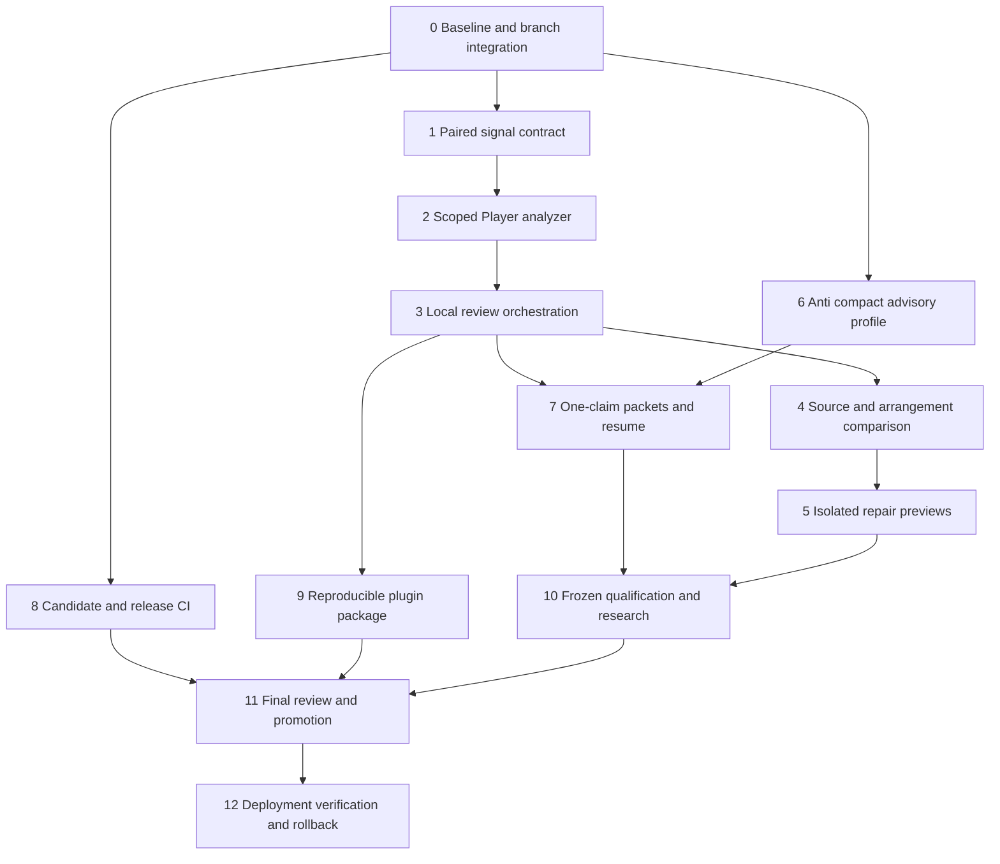

# Music Evidence Through GitHub Deployment Implementation Plan

> **For agentic workers:** REQUIRED SUB-SKILL: Use superpowers:executing-plans to implement this plan task-by-task. Steps use checkbox (`- [ ]`) syntax for tracking. Native execution is the existing user preference; do not create subagents or new chats for this plan.

**Goal:** Deliver a scoped, reproducible music-evidence workflow and compact Gemini interpretation through reviewed GitHub releases, then authorized production deployment with verification and rollback.

**Architecture:** Keyspilli captures paired Player signals and owns all local analysis, score/source comparison and isolated repair previews. Anti consumes portable evidence through an optional one-claim Gemini review profile and remains standalone. Broader transcription/weak-note research has independent gates and never silently changes released defaults.

**Tech Stack:** Existing TypeScript/npm workspaces, Node 22.22.3, Playwright/Web Audio, Python/NumPy/SciPy, Anti Python CLI, GitHub Actions, GHCR, Ansible, Docker Compose and PyPI.

**Spec:** [Music evidence release design](../specs/2026-10-06-music-evidence-release.md). Read that design and the existing `docs/decisions/0004-release-gates.md` before execution.

## Global constraints

All exact limits and ownership rules in the spec's Global constraints apply to
every task. In particular: Mac reserve 30 GiB; no VPS builds; paired signals
<=4s/2MiB each; Player 1.2s/44.1kHz/440refs/16-atom batches/eight events/5%/-50dBFS/
amplitude0.05/weak activation withholding/128ms history; cache cap4GiB, fit RSS2GiB,
analyzer timeout120s; Anti one attempt90s/2048 default4096 explicit/two PCM16 clips
<=2MiB/30s each; compact mode one clip/one claim/one finding/500-character texts/
four240-character limitations; repair <=8edits/phrase. Provider calls/uploads
during AFK are zero. No catalog rebuild, silent provider fallback or automatic
repair/publication. Existing routes and legacy receipts remain compatible.

This is a plan, not execution authorization for merges, tags, adoption or live
uploads. No task requires the owner to approve a vague future action. Prepare
the exact candidate and final decision packet before requesting those actions.

## Review focus

1. A valid WAV with falsely asserted provenance must not become authenticated input-domain or source truth merely through hashes; tests in Tasks 1/2/4 preserve this limitation.
2. An expected quiet note absent from candidates must remain uncertain; it must not produce a missing-note repair. Tests in Tasks 2/4/5.
3. An interrupted job or changed assets must not resume against stale output or reuse another route/configuration's result. Tests in Tasks 2/3/6.
4. Unknown source authority and intentional backing-only reductions must survive explanation without becoming defects or approvals. Tests in Tasks 4/6/7.
5. A main push/tag can trigger external deployment/publication before review; Task 8 provides candidate CI, and Task 11 verifies gates before either boundary.

## Verified starting points — 6 October 2026, Oslo

| Surface | Observed state | Execution consequence |
|---|---|---|
| Keyspilli review checkout | `/Users/reidar/.codex/worktrees/keyspilli-music-review-afk/Keyspilli`, `726425741d610963a8ae3f7e8082806aaeebc6f5` | Preserve closed experiments; start follow-up code in an isolated `codex/` branch |
| Keyspilli #218 | Open draft, base `codex/keyspilli-listening-review`; container-smoke37441436803/job112195882984 passed | Main workspace CI has not run on this stacked base |
| Keyspilli #216 | Open draft against main, head `b75067169a1959c31199f277c4fec3ba4f96f47d` | Dependency must be reconciled before #218 integration; CLEAN is not release readiness |
| Keyspilli main/live | `46e7b666799de4f7b18ba714ea12d44549b7ad29`; both live containers healthy | Research changes are not production changes |
| Live images | web `sha256:e9e5f9ec489ee6ac0342e971150db68e8d9a632e89a2abe738dd000a6e8847eb`; worker `sha256:01a7628eb7b86fff18fb1892dc709a2c6f771f61ac5422f18eeb17f02a4868ff` | Refresh/pin both again before deployment; retain as current rollback candidates |
| Live endpoint | `127.0.0.1:3008`; health version matches full SHA;2730songs; directAudioAmt=false | Preserve capabilities/data. Health alone is not playback/export/music acceptance |
| Backup | service Result=success/ExecMainStatus=0, exit06Oct03:02:48UTC (05:02Oslo) | Refresh manifest/hash/restore evidence at release; inactive oneshot alone is not failure |
| Anti #169 | Open draft against main, head `4586747cc4b2615855bae99b44292da862767c27`, UNSTABLE;11successful/11cancelled checks | Require a fresh complete run; do not reuse cancelled results |
| Anti main/release | main `b7f2394bb7ea39ef5959362ab67eb8bcb782cc04`; checkout package2.4.2; latest GitHub release observedv2.4.1 | Reconcile drift and actual remote tags/PyPI before choosing a new version |
| Keyspilli plugin | canonical `/Users/reidar/plugins/keyspilli` is not a Git repo; outputguard cache exists and workflow SHA49730515bfe59554460d0747aeefc9199a2f65d0840bd2bb4670c0fedbcc1ad2 matches prepared source | Previous adoption-pending snapshot is historical; verify active-session selection separately |
| Disk | Mac38GiB; VPS22GiB, many occupied ports | Recheck before each large step; use GitHub for images, reserve canary space and avoid Docker/volume pruning |

Snapshots expire. Refresh them before code integration and before promotion.
No secrets, account stores, private media or evaluator keys belong in the plan/PR.

## Workstreams and dependency order



PR units: K1=Tasks1–2, K2=Tasks3–5, A1=Task6, K3=Task7, K4=Task8,
K5=Task9. Qualification receipts accompany their owning PR; no private WAVs or
keys are committed. Task0 reconciles the existing base before these follow-ups.
Task10's research-only changes use separate PRs and remain disabled if unqualified.
Tasks11–12 are release operations, not a blanket approval to merge.

## Task 0: Preserve and reconcile the integration baseline

**Files:** existing #216/#218 and Anti#169 histories; this plan/spec; `output/music-review/release-<UTC>/baseline.json` (private).

**Interfaces:** Consumes current remote main/PR heads and protected-state manifests. Produces baseline.json with repository/head/tree/dirty state, dependency order, current CI, live image digests, data/backup identities and release scope.

- [ ] Read applicable checkout/ancestor AGENTS and retain primary WIP/human export/stopped-study hashes. Verify disk reserve; inventory attached managed worktrees before creating another. Reuse suitable checkouts; otherwise create isolated `codex/music-evidence-<unit>` branches from the explicitly pinned base.
- [ ] Fetch remote refs and compare main against #216/#218 and Anti#169; inspect conflicts in an isolated integration branch. Refresh prior read-only production/backup facts without reading `.env`, token files or dumping container environment.
- [ ] Retain #216's ancestry and source separately; assemble #216+#218 on current main for candidate CI without pushing main. Retarget only when the verified dependency is integrated, or create a single reviewed integration PR preserving both heads. No squash that loses required dependency proof; do not merge two duplicate trees.
- [ ] Rebase/merge Anti#169 onto current Anti main in isolation; identify source/version/test-harness differences rather than treating UNSTABLE as only an audio problem.
- [ ] Create one protected baseline.json and run `git diff --check`. Passing means exact dependency provenance and no lost WIP; no deployment occurs. Commit only the reviewed integration/documentation changes in the relevant PR.

## Task 1: Version and validate paired Player signals

**Files:** Create `packages/catalog/src/player-input-evidence.ts`, `packages/catalog/src/player-input-evidence.test.ts`; modify `apps/web/e2e/player-audio-capture.ts`, `apps/web/e2e/music-review-capture.spec.ts`, `apps/web/playwright.music-review.config.ts`, `docs/ops/player-signal-controls.md`.

**Interfaces:** Export `PlayerSignalPinV1`, `PairedPlayerCaptureV1`, `PlayerInputEvidenceReceiptV1` exactly as the spec defines; `parsePairedPlayerCapture(value: unknown): PairedPlayerCaptureV1`, `parsePlayerInputEvidence(value: unknown): PlayerInputEvidenceReceiptV1`. Existing `capturePlayerClip`/`savePlayerCapture` emit the paired manifest only when explicitly requested.

- [ ] Add failing `rejects_mismatched_signal_frames_or_clock`, `rejects_nonfinite_profile`, `preserves_input_above_unity`, `does_not_convert_output_to_input_provenance`, and `legacy_capture_remains_mono_pcm16` assertions. Keep the existing unsorted/nonfinite-start rejection before catalog creation.
- [ ] Run `npm exec -w @keyspilli/catalog -- vitest run src/player-input-evidence.test.ts`; verify a real new-contract failure.
- [ ] Implement strict parsing and byte/rate/channel/frame/hash checks using existing identity helpers. Explicitly label metadata as provenance assertions; reject malformed pins before launching a browser/analyzer. Do not put Float32 input into the old canonical PCM16 audio contract.
- [ ] Run focused unit tests and both isolated recorder-clock/capture tests with a new scratch catalog. Verify default capture unchanged, equal frame origin, original Float32 values, bounded signals and owned-browser cleanup.
- [ ] Commit K1 contract changes after tests pass. No human listening or provider access is needed.

## Task 2: Make the full-range input analyzer a maintained opt-in command

**Files:** Create `services/transcribe/src/player_input_evidence.py`, `services/transcribe/test/test_player_input_evidence.py`, `services/transcribe/requirements-player-evidence.txt`, `apps/web/scripts/build-player-reference-bank.mts`, `apps/web/src/lib/player-reference-bank.test.ts`; modify `docs/ops/player-full-range-controls.md`.

**Interfaces:** Python `analyze_player_input(request: dict) -> dict` returns `PlayerInputEvidenceReceiptV1`; `write_player_input_evidence(request: dict, output: pathlib.Path) -> None` writes exclusively into a new directory. Request keys: `captureManifestPath`, `referenceManifestPath`, `dictionaryDir`; target score/notes/timing keys are forbidden. Builder command: `--sample-assets PINNED.json --module LOCAL.mjs --output NEW_BANK`; it requires already present assets and never fetches them implicitly.

- [ ] Write failing tests: `test_refuses_compressed_or_inferred_input_before_bank_access`, `test_reference_hash_or_cache_identity_drift_refuses`, `test_partial_cache_and_interrupted_build_refuse`, `test_weak_activation_withholds_pitch_set`, `test_low_level_refuses_without_absence_claim`, `test_expected_notes_never_enter_fit`, `test_output_exists_refuses`. Pin the spec's exact bounds in assertions.
- [ ] Run `.venv-audio/bin/python -m pytest services/transcribe/test/test_player_input_evidence.py -q`; verify failures before importing the private prototype.
- [ ] Extract the frozen input-side algorithm into the maintained module without changing search settings. Separate validation/reference/cache loading from fitting. Keep current presence/completeness/audibility unknown and expose only history candidates; validate sample-library/browser/profile identities and preserve the metadata-authentication limitation.
- [ ] Implement offline reference generation from existing smplr behavior and explicitly permitted assets; pin rights/source/hash records before acquisition. If permission or asset identity is unavailable, return unavailable and ship code without a bank. Use16-atom batches, exclusive staging, an atomic complete manifest and4GiB cap; stale cache never rebuilds during inference.
- [ ] Verify the old53/54 screen reproduces as development replay, all440reference digests and40correspondence controls match, rejection tests pass and resource ceilings hold. A changed algorithm requires a new fingerprint; replay is not fresh qualification. Finish K1 and commit.

## Task 3: Assemble one repeatable offline Player review

**Files:** Create `apps/web/scripts/prepare-player-music-review.mts`, `apps/web/src/lib/player-music-review.ts`, `apps/web/src/lib/player-music-review.test.ts`; modify `apps/web/src/lib/music-review.ts`, `apps/web/src/lib/music-review.test.ts`, `apps/web/src/lib/music-review-cli.test.ts`, `apps/web/scripts/report-music-review.mts`.

**Interfaces:** `preparePlayerMusicReview(capture: PairedPlayerCaptureV1, options: {execute:boolean; python:string; referenceManifestPath:string; dictionaryDir:string}, output:string): Promise<PlayerInputEvidenceReceiptV1>`. `MusicReviewInput.clips[].playerInput?: PlayerInputEvidenceReceiptV1`; report capability `playerInputEvidenceVersions:[1]` describes software compatibility, not qualification.

- [ ] Add failing tests `prepare_only_spawns_nothing`, `missing_backend_yields_unavailable_channel`, `analyzer_timeout_preserves_partial_report`, `changed_input_refuses_resume`, `input_pitch_channel_keeps_output_audibility_unknown`, `legacy_v1_report_still_valid` and HTML-escaping/local-media tests.
- [ ] Run `npm exec -w @keyspilli/web -- vitest run src/lib/player-music-review.test.ts src/lib/music-review.test.ts src/lib/music-review-cli.test.ts` and observe failure.
- [ ] Implement a single explicitly invoked local process with120s timeout, isolated output and bounded logs; return failed/unavailable rather than inventing empty success. `report-music-review` continues to assemble only; inference is confined to the new opt-in preparation command. Do not add an HTTP upload/inference route.
- [ ] Add report panels for input-side history, audible PCM measurements, authored intent, source correspondence and Gemini advisory results with distinct labels/hashes. Use neutral unavailable/uncertain text; no current-key or completeness badges.
- [ ] Run positive/negative actual CLIs in fresh directories; verify zero network/provider calls, no catalog write and valid linked media. Commit the first K2 unit.

## Task 4: Compare evidence with arrangement intent and source

**Files:** Modify `apps/web/src/lib/music-correspondence.ts`, `apps/web/src/lib/music-correspondence.test.ts`, `apps/web/src/lib/music-event-comparison.ts`, `apps/web/src/lib/music-event-comparison.test.ts`, `apps/web/src/lib/player-music-review.ts`; create `apps/web/src/lib/player-history-comparison.test.ts`.

**Interfaces:** Keep `compareMusicalIntent` and existing `ReplaySnapshot`/`SourceAnchors`/`ArrangementIntent`. Add `comparePlayerHistory(receipt: PlayerInputEvidenceReceiptV1, snapshot: ReplaySnapshot): {supportedPitches:number[]; unsupportedExpectedPitches:number[]; unexpectedCandidates:number[]; disposition:'inspect'|'uncertain'; limitations:string[]}`. Comparison runs after the analyzer's immutable receipt is written.

- [ ] Failing tests: expected pitches never narrow reference search; clip/source clock mismatch refuses; backing-only melody omission is permitted; approved octave reduction is distinguished; unknown source remains unknown; an unsupported quiet pitch yields uncertain inspection and no missing-note assertion.
- [ ] Run the three comparison test files and verify failure for the new interface.
- [ ] Bind authored replay/source pins and intervals using existing clock/anchor logic. Compare only the measured1.2s history interval; do not turn set correspondence into event onset/release accuracy. Preserve defining source landmarks and mode-specific allowed reductions.
- [ ] Verify clean and deliberately wrong octave/rhythm/source/control cases produce localized findings with the correct origin. Later held-note windows and unsupported source domains remain uncovered. Run targeted tests and commit K2 comparison changes.

## Task 5: Connect justified findings to isolated repair previews

**Files:** Modify `apps/web/src/lib/music-repair-preview.ts`, `apps/web/src/lib/music-repair-preview.test.ts`, `apps/web/scripts/preview-music-repair.mts`; create `apps/web/src/lib/player-repair-boundary.test.ts`; update `docs/ops/music-review.md`.

**Interfaces:** Reuse `RepairProposal`, `RepairOperation`, `previewMusicRepair`. Add a validation helper `validatePlayerRepairEvidence(proposal: RepairProposal, receipt: PlayerInputEvidenceReceiptV1): void`; this validates provenance/scope and cannot generate edits itself.

- [ ] Write failing tests rejecting missing-note edits supported only by absence from candidates, stale evidence, changed source, wrong-domain audio and >8edits; pin unchanged neighbors and zero catalog writes. Positive test uses an explicitly source-supported bounded pitch edit, not an inferred quiet omission.
- [ ] Run the preview/boundary tests before changing implementation.
- [ ] Require explicit proposal and valid supporting source/evidence; produce before/after artifacts and new replay/capture requirements. Playback bugs produce a software reproducer rather than score compensation. Preview status remains pending musical approval.
- [ ] Run actual preview CLI with source-supported and rejected cases; verify untouched snapshots/catalogs, new hashes and playable files. Commit K2 after focused tests pass.

## Task 6: Compact standalone Gemini review in Anti

**Files (Anti):** Modify `codex_antigravity_auth/skills/anti/scripts/anti.py`, `codex_antigravity_auth/skills/anti/scripts/anti_lib/music_evidence.py`, `codex_antigravity_auth/skills/anti/MUSIC_REVIEW.md`, `tests/test_music_evidence.py`, `tests/test_gemini_music_review.py`; modify `scripts/check_installed.py` to exercise installed music modules/tests. Add `codex_antigravity_auth/skills/anti/schemas/music-review-compact-v1.json` to `codex_antigravity_auth/skill_assets.json`.

**Interfaces:** Add `review-music --compact-review`. `build_compact_music_prompt(evidence:dict, objective:str)->str`; `validate_compact_music_review(value:dict, clips:list, claim_ids:tuple=())->dict`; `parse_review_response(..., compact:bool=False)` retains its existing two-value return. `prepare` selects the compact schema only for the opt-in flag; legacy defaults/limits remain intact.

- [ ] Failing tests: require exactly one clip/one claim, refuse unknown references and stale hashes before dispatch; enforce one finding and text limits; preserve whole-fence/raw JSON handling; truncation stays partial with exactly one call; no retry/fallback; no-audio refusal and missing evidence do not become approval. Test compact absent leaves the existing schema unchanged.
- [ ] Run `python3 scripts/run_tests.py tests/test_music_evidence.py tests/test_gemini_music_review.py -q` using Anti's scrubbed runner; observe the new flag/interface failure.
- [ ] Implement the compact schema/prompt/validator with standard-library-only dependencies. Retain model-advisory origin and not-established acceptance; a cited measured claim is supplied evidence, not independently heard truth. Do not silently change reasoning settings, token defaults or account selection.
- [ ] Update the asset manifest and wheel/sdist installed checks so missing music modules/schema actually fail. Run `python3 scripts/check_artifacts.py` on fresh artifacts and installed wheel/rebuilt-sdist tests, plus existing route/parser/spend controls. Freeze the portable evidence-v1 schema unchanged unless a separately reviewed version is necessary.
- [ ] Commit A1, open/update its focused PR on the reconciled Anti base, and require current-head complete platform/quality checks. No live generation at this stage.

## Task 7: Prepare one-claim jobs and reliable local result import

**Files (Keyspilli):** Create `apps/web/src/lib/music-review-jobs.ts`, `apps/web/src/lib/music-review-jobs.test.ts`, `apps/web/scripts/prepare-music-review-jobs.mts`; modify `apps/web/src/lib/anti-music-evidence.ts`, its tests and music report integration.

**Interfaces:** `prepareCompactReviewJobs(report:MusicReviewReport, output:string):Promise<CompactReviewJobV1[]>`; `importCompactReviewResult(job:CompactReviewJobV1, resultPath:string):Promise<CompactReviewJobV1>`. Preparation writes one existing evidence-v1 claim and one clip per packet, objective and digests; it makes no provider call. The owner/operator explicitly invokes Anti's command for each approved job.

- [ ] Failing tests: no subprocess/network during preparation; no local path in portable JSON; measured vs authored/model/human origins preserved; injected claim text stays data; wrong clip/claim/route/hash/config or truncated output cannot complete a job; unchanged neighboring jobs remain not-run.
- [ ] Run `npm exec -w @keyspilli/web -- vitest run src/lib/music-review-jobs.test.ts src/lib/anti-music-evidence.test.ts` and verify failure.
- [ ] Implement deterministic exclusive job directories and identity-bound resume/import. Retain raw response separately; invalid output never gets repaired by another model or converted into a measurement. Report prepared/completed/partial/failed/not-run coverage explicitly.
- [ ] Validate packets with Anti's installed strict parser and socket-denied dry-run using the selected helper path, exact schema/source digest and declared model. Record zero uploads/attempts. No batch dispatcher or quota daemon is added. Commit K3.

## Task 8: Candidate CI and release protections before main/tag

**Files:** Modify Keyspilli `.github/workflows/ci.yml`, `.github/workflows/tutorial-runtime-candidate.yml`, `deploy/test/test-release-operation.py`; create `.github/workflows/music-evidence-candidate.yml`, `scripts/check-music-release.py`, `scripts/test_check_music_release.py`. Anti modifies `.github/workflows/ci.yml`, `.github/workflows/publish.yml` only as needed for installed compact tests/release evidence. No production deploy is performed here.

**Interfaces:** `check-music-release.py --manifest RELEASE.json` validates commit/artifact/check/gate pins and fails on skipped/cancelled/foreign-head required evidence. Candidate workflow runs on PRs against main and the existing stacked branch; build/test/smoke artifacts are available before production merges.

- [ ] Write failing release tests: cancelled required check is not passing, previous-head success is not current, skipped restore is not restored, missing musical gate blocks production, `deploy_only` cannot reingest catalog. Validate workflow syntax with repository tooling before dispatch.
- [ ] Add focused TypeScript/Python analyzer/packet tests to normal checks. Python optional dependencies use the small pinned Player environment for these tests; no model-weight download, no live account credentials, no full private corpus upload. Small self-authored test fixtures are generated locally.
- [ ] Build web/worker candidates on nativeamd64, record labels/digests, run non-root startup/health/SIGTERM and installed tool smoke. If publishing premerge candidate images is needed, use explicitly named `candidate-<sha>` via an authorized maintainer dispatch; no untrusted fork publication or production environment secret. Keep normal checks/check disk reserve and the full public-seed image restore test.
- [ ] Add an explicit release readiness job/environment boundary before production deploy. Main remains an automatic production trigger, so block promotion until the manifest/gates and reviewed revision are recorded; do not use an always-true override for missing musical evidence. Protected environment reviewer settings are an operator decision, not assumed configured.
- [ ] Run current-head full Keyspilli checks/types/build/catalog/chord/calibration/edge/ops/browser/restore and Anti quality/platform matrix. Capture exact counts, skips, run URLs and artifact digests. Re-run only checks invalidated by later changes. Commit K4 and review this release-protection PR before feature promotion.

## Task 9: Track and package the Keyspilli plugin reproducibly

**Files:** Create tracked `plugins/keyspilli/` from the reviewed canonical22-file source and `scripts/package-keyspilli-plugin.py`, `scripts/test_package_keyspilli_plugin.py`; update plugin `references/music-review-workflow.md`, `scripts/check_checkout.py`, README and version metadata within that tree.

**Interfaces:** Packaging command `--source plugins/keyspilli --output NEW.zip --manifest NEW.json` uses a declared sorted member list, deterministic archive metadata and SHA256s. Preflight distinguishes paired-capture/software compatibility, optional installed analyzer/bank and acoustic admission.

- [ ] Failing tests exclude privateoutput/media/keys/models/references bank/cache/symlinks; reject undeclared/missing members and altered source; two builds of identical source produce identicalZIP hashes. Do not require the archive forever to have22members if a reviewed source addition is declared.
- [ ] Snapshot the current canonical and active cache digests; preserve their preimages. Adopt the tracked tree as the future release source, with explicit mirrors and version manifest. Do not rewrite any installed snapshot during implementation.
- [ ] Update instructions for paired input,1.2s scope, uncertain weak notes, one-claim packets and source-supported previews. Validate preflight on a capable checkout and an incompatible checkout; compatibility must not report provider/hearing/music acceptance.
- [ ] Run package tests, repeated archive build, exact-member checks and fresh-extraction preflight. Attach plugin ZIP/manifest to candidate GitHub artifacts; final installed adoption is a separate reviewed operation. Commit K5.

## Task 10: Freeze qualification and bounded enhancement research

**Files:** Create `docs/ops/music-evidence-release-qualification.md`, `apps/web/scripts/build-player-input-qualification.mts`, its web CLI tests, `apps/web/scripts/evaluate-player-input-qualification.mts`; use new private `output/music-review/release-<UTC>/` studies. Reuse existing `benchmark-music-review.mts`, analyzer workers and retained controls.

**Interfaces:** Builder produces a frozen manifest, code/config/reference/assets digests and private answers. Evaluator receives audio-only analyzer results before opening answers and writes gate/resource/coverage receipts. No expected target value may enter the fitter or provider.

- [ ] Freeze 72 new controlled cases before capture/scoring: 32 core covering all 88 pitches, 16 quiet mixtures, 12 repeat/release cases, and 12 refusal controls (two each: silence, below-level, missing input, stale identity, unsupported profile, honestly labeled final-output domain). Stable-sort fixtures before capture. Core gate >=30/32 exact; quiet >=14/16; repeat >=10/12; zero accepted incorrect/subset/extra-pitch sets; all refusal controls reject; fit p95 <=20s/RSS <=2GiB. Test dishonest provenance separately as an explicit limitation, never as guaranteed domain authentication. Unknown current presence/endings remain unknown regardless of passing history sets.
- [ ] Capture with the fixed paired bounds in an isolated catalog, with heavy fitting stopped. Retain failed traces/attempt IDs. A retry may correct a documented capture defect before scoring; changing algorithm or scoring criteria closes that study and requires a new one.
- [ ] Evaluate maintained code once; retain old54-case and six-output studies unchanged. Failures disable promotion of the new analyzer qualification. A software-only prerelease can still expose unavailable/diagnostic status truthfully.
- [ ] Freeze20rights-cleared source/arrangement/Player phrase pairs from10pieces, both Original and backing-only Chords. Five pieces may develop comparison rules; five remain unopened held-out. Cover quiet melody/bass, repeats, rests, octave reductions, tempo/section changes and ambiguous harmony. Do not claim real-song coverage until actual matching source bytes and source-linked authority are present.
- [ ] Build deliberate wrong-source/octave/rhythm/quiet-omission controls and score each channel separately. Require zero false source-supported defect/repair claims on clean or permitted-reduction controls and rejection of unsupported domains. Real musical suitability is not assigned a synthetic automatic score.
- [ ] Broader transcription work starts from existing BasicPitch/Transkun diagnostics and one primary-source/rights/resource review of a single possible next piano model. Do not download several heavy candidates or reuse rejected defaults. A new candidate needs pinned code/frontend/weights/terms and CPU/native/conversion parity before inference; if unavailable, close preparation with that blocker and preserve the core release path. New full-event admission requires precision>=0.95/recall>=0.90 at50ms, zero critical octave/repeat/silence failures, calibrated uncertainty and separately measured30-second20-clip p95<=60s/RSS<8GiB. Note-offs/pedal get their own truth and gates, not borrowed note-on qualification.
- [ ] Prepare, without sending, a proposed final live compact-Gemini study capped at12generations/uploads, serialone-inflight, one attempt each, no rotation/fallback. Pin one eligible existing Google account/model and aggregate account availability; if in-flight usage is unknown, remain serial and report that limit. Use eight measured-evidence packets and four critical contradictory/silence/unknown-source/malformed controls. Malformed/stale cases must refuse locally before quota; provider interpretation failures stop the affected study. Approved real calls count toward the12ceiling, not a target. Require valid linked bounded findings with preserved uncertainty; success is assisted interpretation only. Independent-hearing qualification is a separate stopped/unqualified lane, not revived by these tests.
- [ ] Prepare complete before/after listening exports and qualified-keyboard/source acceptance forms, carrying prior human comments separately. The owner does not repeat completedr09/r29/r33/commentary observations. No new listening, reviewer contact, external account or upload is performed during AFK.

## Task 11: Final decision packet, PR integration and GitHub publication

**Files:** Create release `RELEASE.json`, evidence index, checks/gate matrix, migration/rollback notes and exact release notes in the private release directory; publish only scrubbed permitted artifacts.

- [ ] Self-review spec/task coverage and source: each listed test exists, each interface agrees, every new finding has a bounded origin/scope, and no private/model/account asset is staged. Review focusedPRs and the final integrated tree; use no paid/external reviewer without the owner's selection.
- [ ] Assemble the final packet: exact repositories/PRs/heads/trees, complete current CI, installed artifact/package tests, frozen acoustic results, nonclaims,10-song musical/keyboard/source gates, before/after previews, live baseline/backup/rollback digests, proposed provider study, signing/adoption and exact merge/tag/deploy actions. All owner-dependent rows have precise evidence or remain pending; no guessed approvals.
- [ ] Present this concrete packet at the end. If requested, run only the approved bounded Gemini experiment and apply its stop rules; then update the packet with real results. Existing authorization is reused where applicable; any new protected operation names its actual reason and target.
- [ ] Keyspilli: review/integrate release protection first; merge approved #216 dependency then retarget #218 to main and require fresh full checks; alternatively merge the reviewed integration retaining both heads once. Follow-up K1–K5 changes merge in dependency order. Do not accidentally deploy intermediate incomplete functionality: keep additions inert until the final qualified manifest/feature scope is present, and require a production gate on every main deployment.
- [ ] Anti: reconcile #169 and A1 with current main, require complete six-platform/runtime test matrix and quality/build checks. Determine the next unused semantic version from actual main/tags/PyPI; bump package/version docs consistently. Build wheel/sdist and complete installed tests for that exact release revision before creating its matching `v<version>` tag. Do not assume2.4.3is available from an old checkout.
- [ ] Publish the approved Anti tag: observe `.github/workflows/publish.yml` through quality/tests/build/PyPI; verify downloaded distribution SHA/content and fresh isolated install CLI/dry-run. Then publish a GitHub release with manifest/checksums/qualification status. A PyPI publication is not proof that the owner's running gateway/helper upgraded.
- [ ] Publish Keyspilli's reviewed GitHub release/prerelease with commit, image digests once available, plugin ZIP/manifest, compatibility guide and scrubbed qualification report. Public artifacts exclude recordings/evaluator keys/reference banks/weights/account data. Plugin version is chosen uniquely and its active loaded path verified after explicit adoption.
- [ ] If any production gate is pending, finish at GitHub prerelease with named blockers; do not merge a branch that would bypass the automatic production boundary. This is an intentional incomplete promotion, not a claim that deployment finished.

## Task 12: GitHub-driven deployment, live verification and rollback

**Files/operations:** Existing Keyspilli `.github/workflows/ci.yml`, `deploy/playbook.yml`, `deploy/templates/compose.production.yml.j2`, `deploy/keyspilli-live-verifier.py`, backup/restore/ops scripts. New release verifier tests live in `scripts/test_check_music_release.py`; changes to existing ops tools get their corresponding `deploy/test/` regression.

- [ ] Immediately before promotion, re-read remote/main/release heads, gate manifest, protected deployment environment, occupied ports, disk/image pull headroom, active imports/jobs and backup service Result/timestamp. Validate backup manifest/hashes and an isolated restore using current application-image checks. A historical successful oneshot is insufficient. Preserve production2730-song/owner baseline as a time-stamped inventory, not a fixed future expected total.
- [ ] Freeze the last-good web+worker immutable tags/digests, full revision, compose config/Caddy boundary, volume references and backup. Verify both images are retained. Do not prune Docker volumes, replace catalog, clone source onto VPS or change existing account secrets.
- [ ] Run an authorized GitHub candidate build/smoke before production. If a VPS canary is necessary, use an isolated compose project/volume and a newly checked free loopback port (candidate3240is provisional, not allocated), no Caddy/public binding, no production DB mount or worker queue. Seed only public self-authored controls. Confirm resource headroom and clean only owned canary containers/volumes after inspection.
- [ ] After the final approved main push/merge, observe checks -> `build-and-push` -> production environment -> `deploy`. Pin both SHA-tagged GHCR images and recorded digests; verify OCIrevision labels equal the final40-character commit. Use default/explicit `deploy_only`; prohibit `rebuild_target`/`rebuild_all` and any restore-curated/reingest operation for this release.
- [ ] Verify Ansible's controlled replacement/rollback and production manifests use the exact web/worker pair. Preserve catalog, owner state, exports and queue; migrations are not introduced by this plan. If integration adds a migration unexpectedly, stop to design/test compatible deployment and restore rather than run it implicitly.
- [ ] Verify `/api/health` internally matches version/image; both containers healthy; worker start/idle/SIGTERM controls; anonymous public edge returns the currently configured denial (workflow401), authenticated public health matches the release SHA; directAudioAmt remains false. Use existing verifier environment contract without writing credentials into command text/files/logs.
- [ ] Check catalog inventory and selected Original/Chords replay/source pins, persisted user state, MIDI/MusicXML/PDF export, report capability/CLI on the deployed artifact and absent automatic music inference. A health200alone is not success. Perform browser smoke on a scratch/private accepted fixture; musical/source/physical acceptance stays in its own receipt.
- [ ] Record two successful authenticated readback samples at promotion and10minutes later plus one follow-up within24hours when execution is authorized to remain active. No unattended timer/automation is created by this plan. Record full version, image IDs/digests, checks, inventory deltas and gate status; do not claim elapsed soak until it actually occurred.
- [ ] On failed version/image/auth/catalog/export/worker checks, stop promotion and redeploy the frozen last-good web+worker pair with its fullAPP_VERSION through the existing playbook. Reverify health, edge, exports and data. Keep persistent data unless a separately reviewed restore is necessary; a code rollback is not permission to overwrite owner data.
- [ ] For Anti/helper/plugin regressions, restore the verified prior installed package/profile and confirm selected helper path/digests and socket-denied commands. Preserve account stores and unrelated routes. A defective public Anti version gets a new corrective version after tests; no artifact overwrite or silent route/provider switch.
- [ ] Close only fully accepted tasks/issues; record remaining acoustic/music/provider gates as open. Attach all created/updated PRs to this chat, archive only no-longer-needed managed worktrees with preserved evidence, verify owned scratch/browser/service cleanup, and append final Obsidian project/daily evidence.

## Required validation commands

Run these from the matching clean candidate checkout, using the explicit runtime;
counts are captured from execution, never copied from old reports.

```sh
# Keyspilli: local unit/type/build and catalog gates
PATH=/Users/reidar/.local/bin:$PATH npm test
PATH=/Users/reidar/.local/bin:$PATH npm run typecheck
PATH=/Users/reidar/.local/bin:$PATH npm run build
PATH=/Users/reidar/.local/bin:$PATH npm run verify-catalog
PATH=/Users/reidar/.local/bin:$PATH npm run verify-chord-sources -- --require-catalog
PATH=/Users/reidar/.local/bin:$PATH npm run calibrate
.venv-audio/bin/python -m pytest services/transcribe/test -q
git diff --check

# Anti: scrubbed checked runner and package gates
python3 scripts/run_tests.py -q
python3 scripts/run_tests.py tests/test_music_evidence.py tests/test_gemini_music_review.py -q
python3 -m build --sdist --wheel --outdir "$music_release_dist"
python3 scripts/check_artifacts.py --dist "$music_release_dist"
python3 scripts/check_installed.py --dist "$music_release_dist"
```

Set `music_release_dist` to an exclusive new absolute directory before the Anti
package commands; never mix prior artifacts with the current release build.
Browser/capture commands use fresh run-specific directories, existing
`playwright.music-review.config.ts` and the recorder-clock/capture specs. Normal
CI also runs its four browser configurations, ops/private-edge tests and the
public-seed current-image restore. Catalog pipeline/idempotence runs only against
the isolated seed/scratch catalog; these examples are not permission to rebuild
production or write primary-checkout artifacts.

## Completion criteria and honest fallback

| Milestone | Done only when |
|---|---|
| Implementation | Interfaces/regressions/actual CLI/package tests pass; exact source pins retained; zero forbidden side effects |
| Scoped acoustic qualification | New frozen72-case gate passes; no accepted wrong/partial sets; declared resources/scope match measurements |
| Broader transcription enhancement | Separate held-out real-source/event/30-second gates pass; otherwise diagnostic/not-admitted |
| Compact Gemini qualification | Approved bounded live study passes its own controls; otherwise prepared software with live interpretation unqualified |
| Musical suitability | ADR0004 ten-song mode-specific listening and qualified keyboard/source evidence exists for exact outputs |
| GitHub release | Exact approved artifacts/images and checks are published/read back; prerequisites and limitations are explicit |
| Production deployment | All four Keyspilli gates, authorization, exact live image/version/auth/data/export/worker checks and rollback proof pass |

If experiments fail, ship no false capability claim. Preserve completed software
and a reproducible GitHub prerelease where authorized; leave the failed detector
disabled and production gate pending. Deployment cannot be promised before the
required musical/operational evidence is available.

## Plan self-review

Spec ownership/limits/interfaces are mapped to Tasks1–7; research/admission to10;
publication/installed artifacts to8–9/11; protected live runtime and rollback to12.
All five review-focus failures have owning test steps. Existing comparison/preview
APIs are reused, no new provider route/default is selected, and no unresolved
scientific result is made an unconditional release prerequisite. File discovery
and command signatures must be verified on the final integrated revision; every
known baseline drift or unavailable acceptance condition has an explicit gate.
